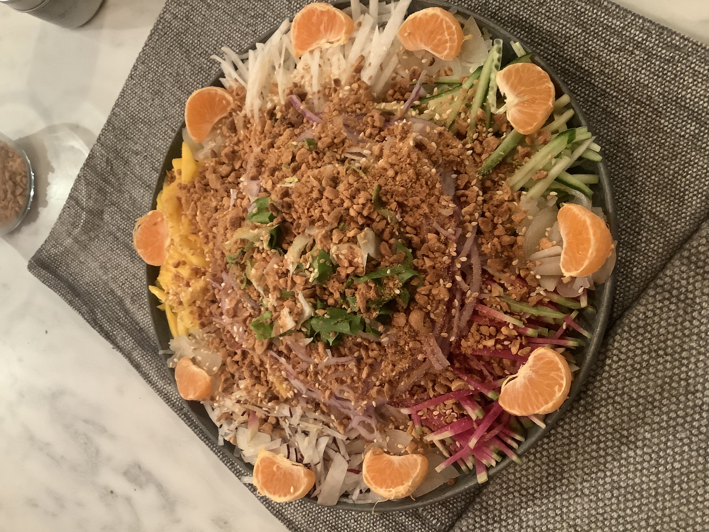
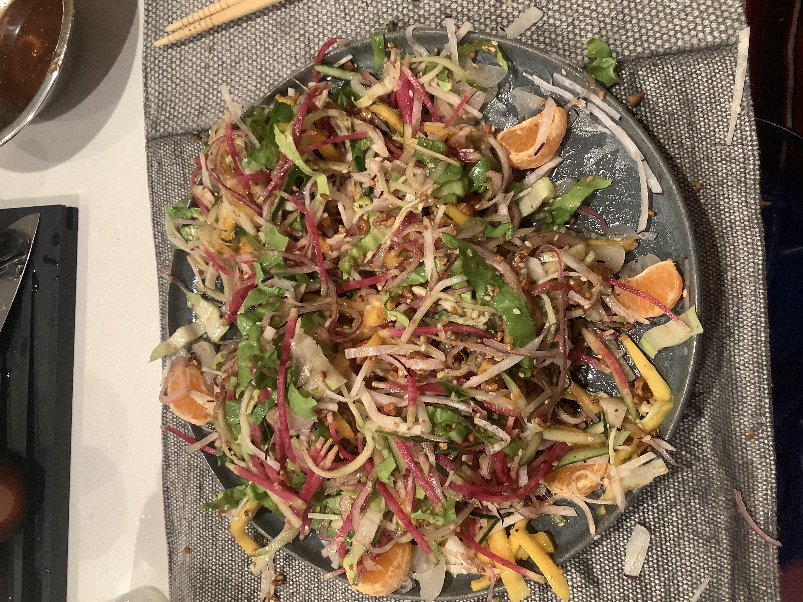

# Lou Shen - Malaysian Chinese new year salad 

## Intro

A delicious salad to ring in the new year! It typically has raw fish to signify abundance in the new year and tossed by everyone at the table as high as possible for goodluck. 

## Ingredients

* Raw salmon or whatever is available - OPTIONAL to make it vegetarian
* Pomelo peeled and broken into little pieces - grapefruit can be used
* Pickled shallots - white in jars - known in Hokkien as Kio Tau or 桥头
* Water chestnut shredded
* Jicama Shredded
* Green Spring Onion Sliced
* Chinese Parsley - 芫茜
* lettuce or any greens you like
* Shaved carrots/Daikon/Radish/Cucumbers - add however much you like/have
* Cornflakes/Crunchy crackers bits
* Chopped roasted peanuts 
* Roasted sesame seeds
Note: Anything to make the salad colorful is a good thing. None of the above are necessary but are what makes the traditional salad. You can mix and match with whatever you have. I made one this year with what I had in the fridge: watermelon radish, lettuce, hakurei turnips, cucumber, red onion, mango, easter egg radish and pickled shallots.

Dressing
* Sour Plum sauce
* Honey
* Lime juice
* Olive oil
* Five spice powder
* White/Black pepper

## What you need

* Large shallow plate for placing salad - I use a baking tray on a layer of table cloth underneath (it gets messy with the tossing but that is the whole point and part of the fun!)
* A good knife - plenty of chopping to be done
* Food processor for shredding 

## How to do it

Slice/chop everything up.

Decorate your plate as you like. I added mandarin slices as garnish.

Tip: To save time and effort if you are making a big salad, use your food processor to shred everything.

Make the dressing - the proportions is the same as every other dressing - add/more or less to your liking - it should taste balance.

Get your chopsticks ready to toss the salad up high with everyone at the table while saying all the great things that will happen in this coming year!

## Allergies and dietary requirements

* Dairy free
